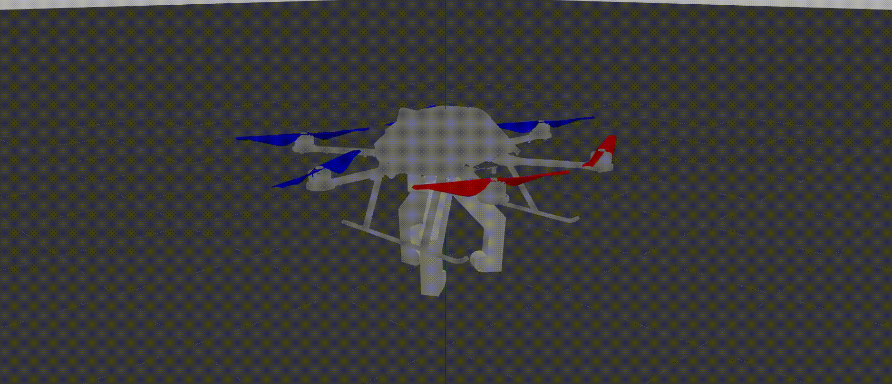
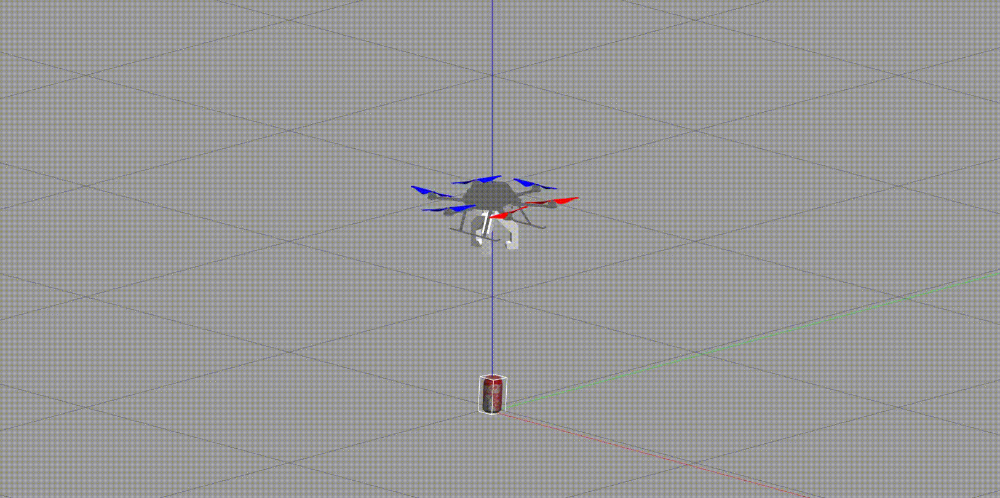

# Applied Swarm Robotics on Object Collection in a Controlled Environment

## > Simulation of Swarm of Custom-Gripper equipped Drones in a classroom environment aimed at picking up garbage collaboratively.

### Developed a Custom 3-arm Gripper of 1 Degree of Freedom to effectively pick-up cans.

### Here's a demonstration of the drone picking up a can from the floor!

